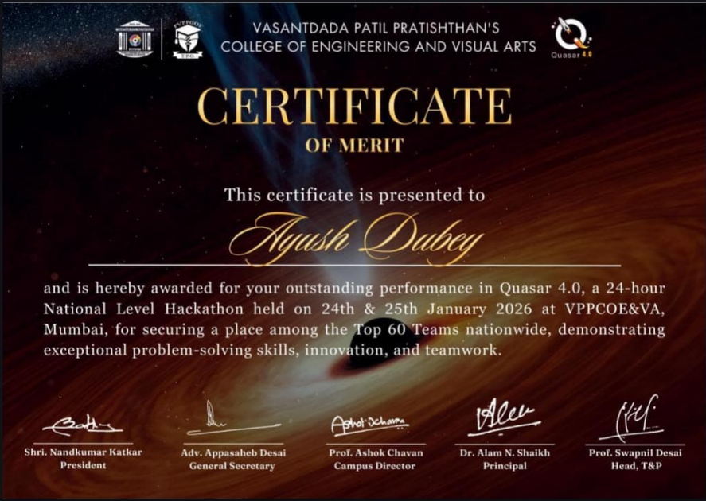
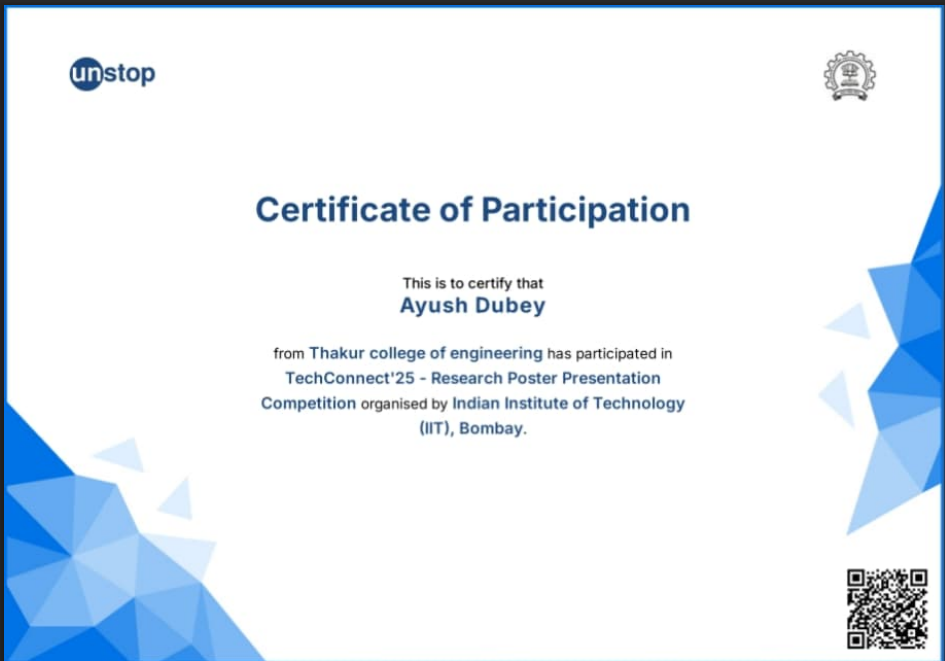
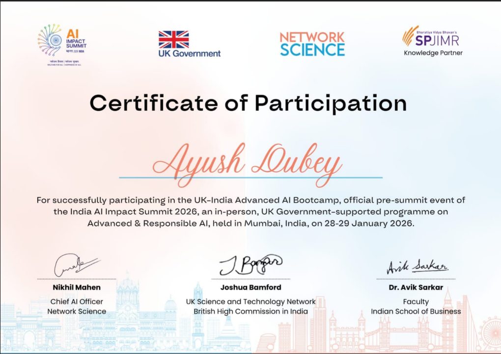
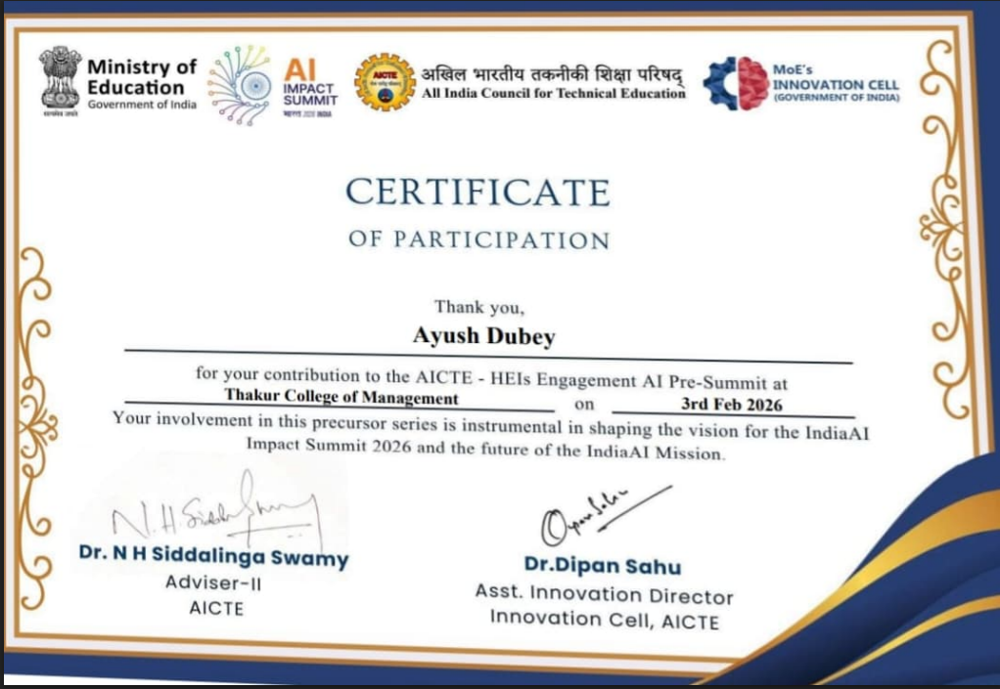
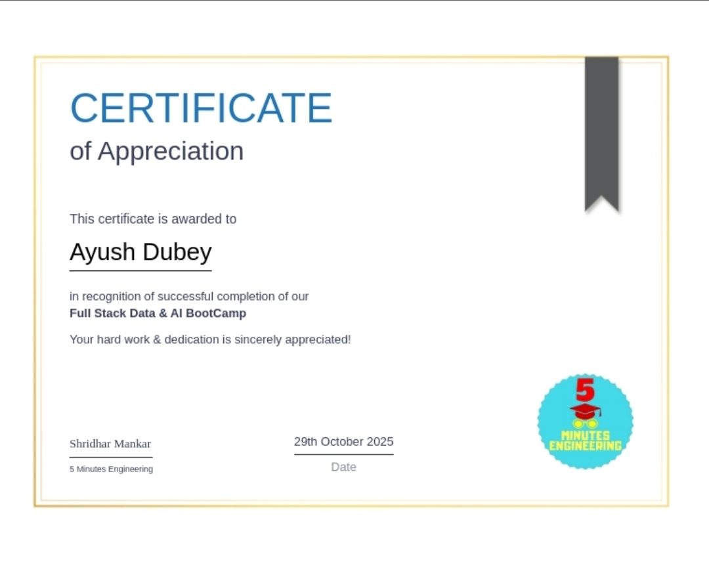

[README.md](https://github.com/user-attachments/files/29886588/README.md)
<div align="center">


<a href="https://github.com/ayush12dubeypro">
  
</a>

<br/>


<br/>


</div>

---

### 👤 Who I Am

```typescript
const ayushDubey = {
  title: "Artificial Intelligence & Data Science (AI & DS)",
  stack: {
    languages: ["Python", "SQL", "Java", "C", "C++"],
    aiAndMl: ["Machine Learning", "Deep Learning", "NLP", "LLM Applications", "Retrieval-Augmented Generation (RAG)"],
    libraries: ["NumPy", "Pandas", "Scikit-learn", "TensorFlow", "Keras", "LangChain", "LlamaIndex", "Transformers"],
    databases: ["MySQL", "MongoDB", "FAISS", "ChromaDB"],
    tools: ["Git", "GitHub", "VS Code", "Power BI", "Tableau", "Google Looker Studio", "Joblib", "Pickle"],
    cloud: ["Microsoft Azure (Databricks)", "AWS"]
  },
  launchedProjects: [
    "Enterprise-Grade Agentic RAG Platform",
    "Safari – Intelligent AI Travel Assistant",
    "Smart Grid Hardware System (Diploma Project)"
  ],
  coreConcepts: ["Electric Vehicles", "Integrated Circuits"],
  certifications: [
    "Full Stack Data & AI Bootcamp",
    "PostgreSQL Bootcamp: Go From Beginner to Advanced"
  ],
  status: "Building production-grade Agentic RAG systems",
  openTo: ["Full-time Roles", "AI/ML Collaborations", "Internships"]
};
```

---

### 🏅 Achievements & Certifications

| Certificate | Achievement | Date |
|---|---|---|
| <a href="./assets/quasar-hackathon.png"></a> | 🏆 Top 60 Nationwide — Quasar 4.0 National Hackathon | Apr '26 – Jul '26 |
| <a href="./assets/travelease-icicn2026.png"></a> | 📄 Research Paper Presenter — "TRAVELEASE" at IC-ICN 2026 International Conference | Feb '26 – Jun '26 |
| <a href="./assets/techconnect25-iitb.png"></a> | 🖼️ Research Poster Presenter — IIT Bombay TechConnect'25 | Jun '23 – Jul '23 |
| <a href="./assets/uk-india-ai-bootcamp.png"></a> | 🇬🇧 Participant — UK–India Advanced AI Bootcamp (UK Government) | — |
| <a href="./assets/aicte-pre-summit.png"></a> | 🎓 Participant — AICTE AI Pre-Summit | — |
| <a href="./assets/fullstack-data-ai-bootcamp.png"></a> | 📜 Certificate — Full Stack Data & AI Bootcamp | — |
| — | 📜 Certificate — PostgreSQL Bootcamp: Go From Beginner to Advanced | — |

*Click any thumbnail to view the full certificate.*

---

### 🚀 Featured Projects

#### 🧠 Enterprise-Grade Agentic RAG Platform

Production-grade Agentic RAG platform for enterprise document retrieval, built with LangGraph, FastAPI, and Qdrant.

[](https://github.com/ayush12dubeypro/Production-Grade-Advanced-Rag)

| Layer | Technology |
|---|---|
| Orchestration | LangGraph |
| API Layer | FastAPI |
| Vector Database | Qdrant |
| Embeddings | Jina AI |
| Retrieval | Semantic Reranking |
| Guardrails | NeMo Guardrails |
| Observability | LangSmith, RAGAS |
| Caching | Redis |

🔗 [Code](https://github.com/ayush12dubeypro/Production-Grade-Advanced-Rag)

<br/>

#### 🌍 Safari – Intelligent AI Travel Assistant

AI travel assistant for itinerary generation, trip optimization, and personalized recommendations, powered by RAG.

[](https://github.com/ayush12dubeypro/safara-tourism)

| Layer | Technology |
|---|---|
| AI Framework | LangChain |
| Retrieval | RAG + Vector Database |
| Safety | Safety Scoring, Anomaly Detection |
| Offline Support | Offline SOS |
| Planning | Intelligent Trip Planning |

🔗 [Code](https://github.com/ayush12dubeypro/safara-tourism)

---

### 🛠️ Tech Stack

**Languages**


**AI / ML & Libraries**


**Database / Vector Stores**


**Cloud**


**Dev Tools & BI**


---

### 📊 GitHub Stats

<div align="center">


</div>

---

### 🏆 Trophies

<div align="center">

</div>

---

### 📈 Contribution Activity

<div align="center">

</div>

---

### 🤝 Connect With Me

<div align="center">

[](mailto:ayushaids@gmail.com)
[](https://linkedin.com/in/ayushaids)
[](https://ayushdubey-portfolio.vercel.app/)

</div>


